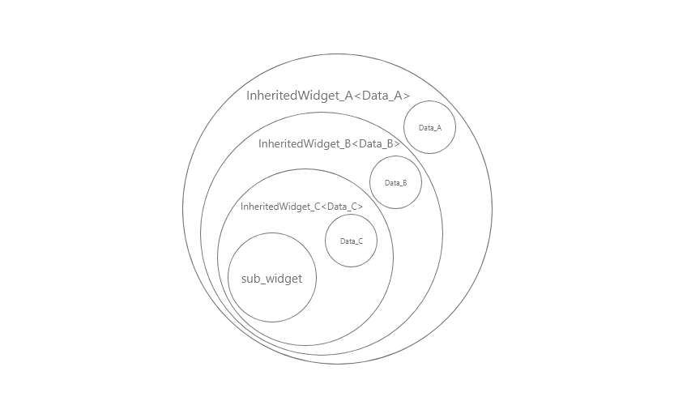

# Flutter State Management Appendix  

## 1. 关于 widget 重绘的性能问题  
Flutter 拥有 Widget Element RenderObject 三种绘制树。  
  
Element 这一层很类似 react 的 VirtualDOM，在生成ElementTree时，会调用Widget 的 canUpdate 方法，来确定之前的组件是不是同类型（并且验证key），以确定是使用之前的组件更新状态渲染（`修改数据`）还是重新渲染（`重新生成组件`）。  

---

## 2. 共享数据组件嵌套，如何找到对应的共享数据组件？  

`dart` 中有一个专门返回 `泛型类` 的函数：
```dart
Type _typeOf<T>() => T;
```
在创建 of 方法时，把 `泛型T` 替换成 `InheritedWidget<Data>`(`<T> => <InheritedWidget<DataModel>>`)，因为 `Data` 的类型可以是唯一的，所以通过该方法可以得到 `自身的类型`。  
然后配合 context（BuildContext 上下文）的 `dependOnInheritedWidgetOfExactType(aspect: type)` 方法来获取InheritedWidget。 **`dependOnInheritedWidgetOfExactType` 方法只能用来查找 InheritedWidget。** 示例：  
```dart
Type _typeOf<T>() => T;
static ShareMainContextWidget of<T>(BuildContext context) {
    // ShareMainContextWidget extends from InheritedWidget.
    // _typeOf will return the type of InheritedWidget with generics T itself.
    final type = _typeOf<ShareMainContextWidget<T>>();
    // dependOnInheritedWidgetOfExactType can only used to find InheritedWidget.
    // sample shows it uses the return type to find the nearest correspond InheritedWidget.
    return context.dependOnInheritedWidgetOfExactType(aspect: type);
}
```

---

## 3. dart 中的异步  
**Future**  
dart语言 中 Future 基本跟 Javascript 中 Promise 相同，使用的方式也很类似，有以下两种：
```dart
// use the key word of async and await
runUsingAsyncAwait() async {
  // ...
  var entryPoint = await findEntryPoint();
  var exitCode = await runExecutable(entryPoint, args);
  await flushThenExit(exitCode);
}

// use the future thenable api
runUsingFuture() {
  // ...
  findEntryPoint()
    .then((entryPoint) {
        return runExecutable(entryPoint, args);
    })
    .catchError((e) {
        // handle errors
    });
}
```
当然还是有其它 API， 可以去官网去学习。  

**Stream**  
dart 语言中的 Stream 是一系列的数据。它可以接收多个异步操作的结果，常用于会多次读取数据的异步任务场景，如网络内容下载、文件读写等。  
使用方式也是两种，一种使用 stream api，另一种 可以使用 await for 循环：  

---


## 4. Flutter 中的异步 （异步UI更新）  
**FutureBuilder**  
`FutureBuilder` 会依赖一个 `Future`，它会根据所依赖的 `Future` 的状态来动态构建自身。
```dart
FutureBuilder({
  this.future,
  this.initialData,
  @required this.builder,
})
```
+ future: builder 依赖的 Future， 通常是一个异步任务。
+ initialData： 初始数据， 设置的默认数据。
+ builder： 构建器； 该构建器会在 Future 执行的多个阶段执行多次。
    ```dart
    Function (BuildContext context, AsyncSnapshot snapshot)
    ```
    `snapshot` 会包含当前异步任务的状态及结果，比如我们可以通过 `snapshot.connectionState` 获取异步任务的状态信息、通过 `snapshot.hasError` 判断异步任务是否有错误等等。  

下面是个例子：  
```dart
class FutureBuilderPage extends StatelessWidget {

  @override
  Widget build(BuildContext context) {
    return Scaffold(
      appBar: AppBar(
        title: Text('FutureBuilder'),
        centerTitle: true,
      ),
      body: _buildBody()
    );
  }

  Widget _buildBody() {
    return Center(
      child: FutureBuilder<String>(
        future: mockNetworkData(),
        builder: (BuildContext context, AsyncSnapshot snapshot) {
          if (snapshot.connectionState == ConnectionState.done) {
            if (snapshot.hasError) {
              return Text("Error: ${snapshot.error}");
            } else {
              return Text("Contents: ${snapshot.data}");
            }
          } else {
            return CircularProgressIndicator();
          }
        },
      ),
    );
  }

  Future<String> mockNetworkData() async {
    return Future.delayed(Duration(seconds: 2), () => '我是异步数据');
  }

}
```


**StreamBuilder**  
`StreamBuilder` 正是用于配合Stream来展示流上事件（数据）变化的UI组件。
```dart
StreamBuilder({
  Key key,
  this.initialData,
  Stream<T> stream,
  @required this.builder,
})
```
构造函数基本与 `FutureBuilder` 一致，除了 `future` 换成了 `stream`。  
```dart
class StreamBuilderPage extends StatelessWidget {
  @override
  Widget build(BuildContext context) {
    return Scaffold(
      appBar: AppBar(
        title: Text('FutureBuilder'),
        centerTitle: true,
      ),
      body: _buildBody()
    );
  }

  Widget _buildBody() {
    return StreamBuilder<int>(
      stream: counter(),
      initialData: null,
      builder: (BuildContext context, AsyncSnapshot<int> snapshot) {
        String showData;
        if (snapshot.hasError) showData = snapshot.error;
        switch (snapshot.connectionState) {
          case ConnectionState.none:
            showData = '没有Stream';
            break;
          case ConnectionState.waiting:
            showData = '等待数据...';
            break;
          case ConnectionState.active:
            showData = 'active: ${snapshot.data}';
            break;
          case ConnectionState.done:
            showData = 'Stream已关闭';
            break;
        }
        return Center(
          child: Text('$showData')
        );
      },
    );
  }

  Stream<int> counter() {
    return Stream.periodic(Duration(seconds: 1), (i) {
      return i;
    });
  }
}
```

以下是 ConnectionState 的状态解释：
```dart
enum ConnectionState {
  // when there is no async task, such as the future or the stream is null
  none,

  // when the async task is on pending (waiting) status
  waiting,

  // when the stream has already post data, the status is active
  // Future has not this status, it is just for stream
  active,

  // the async task has been complete
  done,
}
```

---

## 5. Model 与 JSON 的转换  
**1\. JSON 转换 Model**  
在 Model 中编写 fromJson 方法， 如下：  
```dart
// Model-Class parse JSON to Model
class Article {

  int articleId;
  String title;
  String author;
  String content;
  String updateTime;
  int commentsLength;

  Article.fromJson(Map<String, dynamic> json)
    : articleId = json['articleId'] as int,
      title = json['title'] as String,
      author = json['author'] as String,
      content = json['content'] as String,
      updateTime = json['updateTime'] as String,
      commentsLength = json['commentsLength'] as int;

}

// how to use it
Article.fromJson(data)
```

**2\. Model 转换 JSON**  
```dart
// Model-Class parse Model to JSON
class User {
  final String name;
  final String email;

  User(this.name, this.email);

  User.fromJson(Map<String, dynamic> json)
      : name = json['name'],
        email = json['email'];

  // define toJson method
  Map<String, dynamic> toJson() =>
    <String, dynamic>{
      'name': name,
      'email': email,
    };
}
// how to use it
String json = json.encode(user)
```
在执行 `encode` 方法时，内部会自动执行 `toJson` 方法。

**3\. 列表 Model 的转化**  
```dart
final List<Article> articles = resultData.data.map<Article>((data) => Article.fromJson(data)).toList();
```