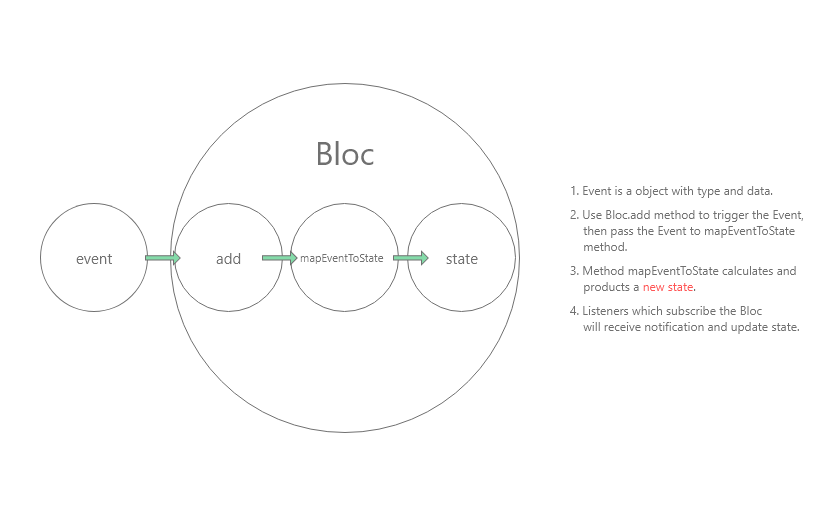

# Flutter State Management Bloc  

## 1. Bloc Base （Bloc 基本原理）  
**1\. Bloc 的原则**  
Bloc 的原则与 Redux 很相似：
+ State 是只读的  
> Bloc 不准许直接修改 State， 要修改State， 只能通过 Event 来修改。
+ 使用纯函数来执行修改  
> Bloc 提供了一个 `mapEventToState` 函数，该函数用来处理数据逻辑，与 Redux 的 reducer 一致，它`只能返回新的 state， 不能修改`。  
Bloc 取消了 Redux 使用的 单一数据原则，它支持可以拥有多个 Bloc 对象，这个完全取决于业务逻辑。

**2\. Event**  
Bloc 的 Event 是更新 state 的触发器， 它可以包含数据，或者仅仅是一个独一无二的类。
```dart
abstract class ArticlesEvent {}

class GetArticles extends ArticlesEvent {}

class AddArticle extends ArticlesEvent {

  final Map<String, dynamic> newItem;
  AddArticle({ @required this.newItem });

}
```
**3\. State**  
State 是 Bloc 所要输出的对象，它保存了 App 的数据、状态。当 State 更新时， UI 也会进行更新。
```dart
class ArticlesState {

  final List<Article> articles;

  ArticlesState({ @required this.articles });

}
```
**4\. Bloc**  
Bloc 是一个接受 Event 并输出 State 的类。对于数据的处理逻辑，都写在该类下。  
使用 Bloc 时， 有两个方法是必须要实现的：
```dart
class ArticlesBloc extends Bloc<ArticlesEvent, ArticlesState> {

  // must implement
  @override
  ArticlesState get initialState => ArticlesState(articles: const []);

  // must implement
  @override
  Stream<ArticlesState> mapEventToState(ArticlesEvent event) async* {
      // ... data logic
  }

}
```
`initialState` 用来提供 Bloc 的初始值。  
`mapEventToState` 用来接受 `Event`， 然后根据其处理逻辑 `产生新的 State`。  

**5\. 数据流**  

1. 初始化 Bloc 类。
2. 通过 `Bloc.add` 方法传入 Event。
3. mapEventToState 接收 Event 进行计算和处理数据业务逻辑，最后产生一个新的 state。
4. 监听了该 Bloc 实例的 listenner 会收到通知并更新 state。  

---

## 2. Bloc in Flutter （Bloc Flutter 实践）  
**1\. 安装依赖**  
```yaml
// dependencies in pubspec.yaml file
dependencies:
    bloc: 3.0.0
    flutter_bloc: 3.2.0
```

**2\. 创建 State**  
```dart
class ArticlesState {

  final List<Article> articles;

  ArticlesState({ @required this.articles });

}
```
**3\. 创建 Event**  
```dart
abstract class ArticlesEvent {}

class GetArticles extends ArticlesEvent {}

class AddArticle extends ArticlesEvent {

  final Map<String, dynamic> newItem;
  AddArticle({ @required this.newItem });

}
```
**4\. 创建 Bloc**  
```dart
class ArticlesBloc extends Bloc<ArticlesEvent, ArticlesState> {

  @override
  ArticlesState get initialState => ArticlesState(articles: const []);

  @override
  Stream<ArticlesState> mapEventToState(ArticlesEvent event) async* {
    if (event is GetArticles) {
      final articles = await HttpService.getArticles();
      yield ArticlesState(articles: articles);
    }
    else if (event is AddArticle) {
      final bool isSuccess = await HttpService.addArticle(event.newItem);
      if (isSuccess) {
        yield ArticlesState(articles: state.articles);
      }
    }
  }

  @override
  Future<void> close() {
    return super.close();
  }

}
```

**5\. 初始化Bloc 并将其传给 UI**  
```dart
class BlocApp extends StatelessWidget {

  @override
  Widget build(BuildContext context) {
    return MultiBlocProvider(
      providers: [
        BlocProvider<AuthorBloc>(
          create: (context) => AuthorBloc(),
        ),
        BlocProvider<ArticlesBloc>(
          create: (context) => ArticlesBloc(),
        ),
        BlocProvider<CommentsBloc>(
          create: (context) => CommentsBloc(),
        ),
      ],
      child: ShareMainContextWidget(
        mainContext: mainContext,
        child: MaterialApp(
            title: 'Bloc State Management App',
            theme: ThemeData(
              primaryColor: Colors.blue,
            ),
            initialRoute: '/bloc-login',
            routes: blocRoutes(context),
          )
        ),
      );
  }

}
```
正常如果一个 Bloc的话，写法应该是这样的：
```dart
Widget build(BuildContext context) {
    return BlocProvider<ArticlesBloc>(
        create: (context) => ArticlesBloc(),
        child: ShareMainContextWidget(
            mainContext: mainContext,
            child: MaterialApp(
                title: 'Bloc State Management App',
                theme: ThemeData(
                primaryColor: Colors.blue,
            ),
            initialRoute: '/bloc-login',
            routes: blocRoutes(context),
        )
    );
}
```
因为此Demo 引用了多个 Bloc， 如果按照正常的写法，此处应该是一层一层嵌套的。但是那样写起来极度麻烦，所以官方提供了一个MultiBlocProvider的类，其中 providers 属性将接受其传入的 Bloc 实例数组，自动嵌套。  

**7\. 获取数据到 UI**  
```dart
Widget _buildBody() {
    return BlocBuilder<ArticlesBloc, ArticlesState>(
      builder: (context, state) {
        final List<Article> articles = state.articles;
        return Container(
          child: ListView.separated(
            padding: EdgeInsets.only(left: 16.0),
            itemCount: articles.length,
            itemBuilder: (BuildContext context, int index) {
              return ArticleItem(article: articles[index], appType: 'bloc');
            },
            separatorBuilder: (BuildContext context, int index) => Divider(
              height: 0.5,
              color: Colors.black26,
            )
          ),
        );
      }
    );
  }
```
`BlocBuilder<B, S>` 是一个监听 Bloc 实例的组件， 当 state 放生变化时，其自身会进行更新。  
+ 泛型类B： 所监听的 Bloc 类型。  
+ 泛型类S： Bloc 中管理的 state 类型。  
+ builder： 构建器，第二个参数是Bloc 所管理的 state。

**8\. UI 更新State**  
```dart
Widget buttonArea(BuildContext context) {
    return Container(
      width: double.infinity,
      height: 52.0,
      child: InkWell(
        child: Center(
          child: Text('Submit', style: TextStyle(
            color: Colors.white,
            fontSize: 20.0
          )),
        ),
        onTap: () {
          final Map<String, dynamic> newItem = {
            'author': BlocProvider.of<AuthorBloc>(context).state.author,
            'content': _itemController.text,
            if (arguments['pageType'] == 'Article') 'title': '临时添加',
            if (arguments['pageType'] == 'Comment') 'articleId': arguments['articleId']
          };
          if (arguments['pageType'] == 'Article') {
            BlocProvider.of<ArticlesBloc>(context).add(AddArticle(newItem: newItem));
          }
          else {
            BlocProvider.of<CommentsBloc>(context).add(AddComment(newItem: newItem));
          }
          Navigator.of(context).pop(true);
        },
      ),
      decoration: BoxDecoration(
        color: Colors.blue
      ),
    );
  }
```
`BlocProvider.of<B>(context).add(Event())`  
BlocProvider 提供的 of 方法可以根据输入的 泛型类B 找到对应的 BlocProvider 中的 bloc 实例。
+ 泛型类B： bloc 实例的类型。
+ add： 触发 Event 的方法， 与 Redux 的 dispatch 类似。

---

## 3. Conclusion  
1\. 文档完美，有教程。如果对强类型的面向对象编程语言很熟悉，上手相当easy。  
2\. 思想与Redux 相近，熟悉 redux 的人上手很快。  
3\. 对于异步的支持，不需要中间件就能完美使用。
