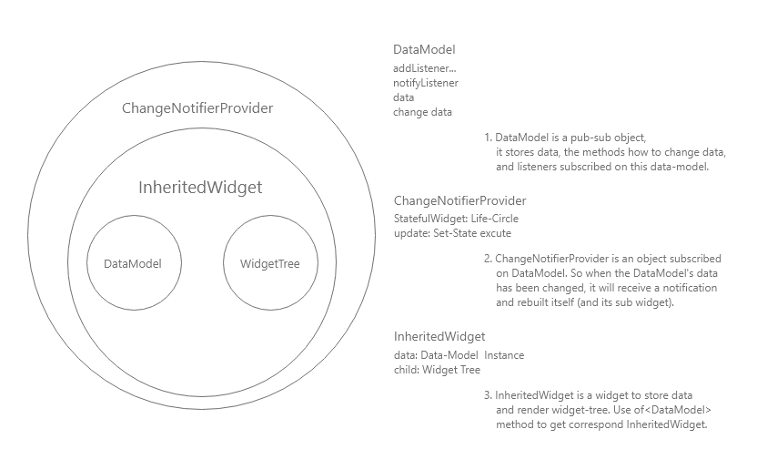

# Flutter State Management Provider  

## 1. Provider Base （Provider 基本原理）  
**1\. DataModel**  
`DataModel` 是一个继承自 Flutter SDK `ChangeNotifier` 的数据类。  
它自身因为继承而拥有了 `addListener`， `removeListener`， `notifyListeners` 等方法，可以添加删除或者通知订阅者。而本身又可以存储数据，以及修改数据的方法。一个 DataModel 大体是这样的：  
```dart
class DataModel<T> extends ChangeNotifier {

  // initial data
  T _data = xxxx;

  T get data => _data;

  // the method of changing data
  void changeData(T changedData) {
    _data = changedData;
    notifyListeners();
  }
}
```

**2\. ChangeNotifierProvider(Provider)**  
`Provider` 有很多种，这里讲下代表的 `ChandeNotifierProvider`， 它可以根据 DataModel 的数据变化而进行重构。以下是一个该类的简单实现：  
```dart
Type _typeof<T>() => T;

class ChangeNotifierProvider<T extends ChangeNotifier> extends StatefulWidget {
  ChangeNotifierProvider({
    Key key,
    this.data,
    this.child,
  });

  final Widget child;
  final T data;

  static T of<T>(BuildContext context) {
    // InheritedProvider is a widget extends InheritedWidget
    // to store the DataModel
    // use _typeOf to get the type of InheritedProvider with
    // correspond type
    final type = _typeOf<InheritedProvider<T>>();
    final provider =  context.inheritFromWidgetOfExactType(type) as InheritedProvider<T>；
    return provider.data;
  }

  @override
  _ChangeNotifierProviderState<T> createState() => _ChangeNotifierProviderState<T>();
}
```
从上面的代码可以看出，`ChandeNotifierProvider` 是一个存储了共享数据组件 和 子组件树的 组件。  
它将传入进来的 DataModel 储存进了 InheritedProvider(InheritedWidget) 中。
```dart
class _ChangeNotifierProviderState<T extends ChangeNotifier> extends State<ChangeNotifierProvider<T>> {
  void update() {
    // this update method will execute when the DataModel
    // trigger the notifyListeners function
    setState(() => {});
  }

  @override
  void didUpdateWidget(ChangeNotifierProvider<T> oldWidget) {
    // When provider update, if the old data and data are not equal
    // then cancel the oldWidget subscribe, add the new one.
    if (widget.data != oldWidget.data) {
      oldWidget.data.removeListener(update);
      widget.data.addListener(update);
    }
    super.didUpdateWidget(oldWidget);
  }

  @override
  void initState() {
    // add update function to listener
    widget.data.addListener(update);
    super.initState();
  }

  @override
  void dispose() {
    // remove update function to listener
    widget.data.removeListener(update);
    super.dispose();
  }

  @override
  Widget build(BuildContext context) {
    return InheritedProvider<T>(
      data: widget.data,
      child: widget.child,
    );
  }
}
```

**3\. InheritedProvider<T>**  
`InheritedProvider` 是一个存在于 `ChandeNotifierProvider` 内部，用来存储数据 和 渲染 组件的组件。  
它继承自 `InheritedWidget`， 并且添加了 `泛型类T`，当多层 InheritedWidget嵌套时，通过 `of<T>` 方法可以得到对应的 InheritedWidget。
```dart
class InheritedProvider<T> extends InheritedWidget {
  InheritedProvider({@required this.data, Widget child}) : super(child: child);

  final T data;

  @override
  bool updateShouldNotify(InheritedProvider<T> old) {
    // logic to control when to update sub widget tree
  }
}
```

**4\. 数据流**  

1. `ChandeNotifierProvider` 接受 DataModel 和 SubWidget， 并`监听 DataModel` 的变化（update 传入 DataModel 的 addListener）。
2. `DataModel` 更新数据时，调用 `notifyListeners` 方法， 调用了之前传入的 `ChandeNotifierProvider` 的 update方法，从而使 `ChandeNotifierProvider`组件以及下面的子组件树也更新。

---

## 2. Provider in Flutter （Provider Flutter 实践）  
**1\. 创建 DataModel**  
```dart
// count_model.dart
class CountModel extends ChangeNotifier {
  int _count = 0;

  int get count => _count;

  void changeCount(int newCount) {
    _count = newCount;
    notifyListeners();
  }
}
```
**2\. 初始化 DataModel 并传给 UI**  
```dart
// part code of provider_page.dart
Widget _buildBody(BuildContext context) {
    return ChangeNotifierProvider<CountModel>.value(
      value: CountModel(),
      child: Container(
        padding: EdgeInsets.all(20.0),
        child: Column(
          mainAxisSize: MainAxisSize.max,
          mainAxisAlignment: MainAxisAlignment.spaceEvenly,
          children: <Widget>[
            /* Text(
              'SuperCount: ${ Provider.of<CountModel>(context).count }',
              style: TextStyle(
                fontSize: 16.0
              ),
            ), */
            WithStateProviderWidget(),
            WithoutStateProviderWidget()
          ],
        ),
      ),
    );
  }
```
这里写法使用了官网文档中的最佳实践推荐的写法，具体可以看官网。  
**注释处是使用时出现的问题，provider使用时，传入数据和引用数据的 context 上下文不能是一个， 因为 of 方法是向上查找 InheritedWidget， 相同 context 上下文当然无法找到对应的组件。**

**3\. 获取数据到 UI**  
```dart
// part code of widget_without_state_provider.dart
Expanded(
    child: Center(
        child:  Text(
            'count: ${ Provider.of<CountModel>(context).count }',
            style: TextStyle(
                fontSize: 24.0
            )
        ),
    ),
)
```
`Provider.of<CountModel>(context)`  
通过 of 方法传入的 DataModel 找到对应的 InheritedWidget， 然后取出数据。

**4\. UI 触发更改数据**  
```dart
// part code of widget_with_state_provider.dart

final CountModel countModel = Provider.of<CountModel>(context);
// ... other code
_buildButton(
    buttonColor: Colors.blue,
    fontColor: Colors.white,
    icon: Icons.remove,
    onPressed: () {
        final int newCount = countModel.count - 1;
        countModel.changeCount(newCount);
    }
),
// ... other code
```
使用方法跟 获取数据到 UI 的方式是一致的。

---

## 3. Conclusion  
1\. 这个库是Flutter开发团队与外部团队合作开发的，是Flutter官方首推的状态管理库，api 相关文档可以在Flutter 官网查到，比较全面。  
2\. 整体的业务逻辑主要在DataModel中，编写量不算特别的大。  
3\. 对于异步的支持暂时没有尝试，估计可以直接在DataModel的方法中直接写异步函数。


