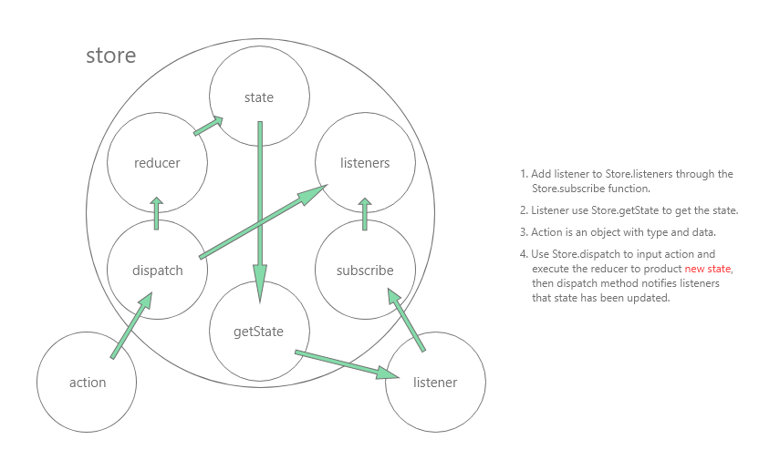

# Flutter State Management Redux  

## 1. Redux Base （Redux 基本原理）  
**1\. Redux 的三大原则**
+ 单一数据源  
> 整个应用的 `State` 被存储在一棵 `object tree` 中， 并且这个 tree 只存在于唯一的 `Store` 中。
+ State 是只读的  
> Redux 不准许直接修改 State， 唯一修改 State 的方法是触发 action， action 是一个描述发生事件的普通对象。
+ 使用纯函数来执行修改  
> 纯函数 Reducer 接受当前 state 和 action 作为参数，产生一个 新的 state（注意： 不是修改 State）。  

**2\. Store**  
Redux 的 Store 在初始化之后，对外提供了三个方法，分别是：
+ 添加 `监听者（listener）` 到 Store 中的方法 `Store.subscribe`。
+ 对外提供 `State` 的 `Store.getState`。
+ 用于接受 `action` 并且 修改 State 的方法 `Store.dispatch`。  

**3\. Action**  
`Action` 是一个修改 State 的触发器， 它包含了 `修改的类型` （要修改 State 的哪个或者哪些字段属性），以及要 `修改的数据`。由于 Flutter 是强类型语言，所以每个 Action 自己就是独一无二的类型。下面是 Javascript 和 Flutter 之间的 Action 实现：  
```ts
    // Action in Javascript
    const DemoAction = {
        type: 'DEMO_ACTION',
        data: data
    };
```
```dart
    // Action in Flutter
    class DemoAction<T> {
        final T data;
        DemoAction({ @required this.data });
    }
```

**4\. Reducer**  
Reducer 是一个纯函数。 它接受现在的 State 和 action， 来产生新的 State。
由于纯函数是不能产生副作用的， 所以它只能产生新值， 而不能修改值。下面是 Javascript 和 Flutter 的实现：  
```ts
    // Reducer in Javascript
    function demoReducer(state, action) {
        switch(action.type) {
            case 'DEMO_ACTION':
                return action.data;
            default:
                return state;
        }
    }
```
```dart
    // Reducer in Flutter
    DemoState demoReducer(DemoState state, action) {
        if (action is DemoAction) {
            return DemoState(data: action.data);
        }
        return state;
    }
```

**5\. 数据流**  

1. Store 初始化时，对外提供了 `subscribe`， `getState`， 以及 `dispatch` 方法。  
2. 监听者（`Listener`） 通过 `subscribe` 方法对 Store 进行了订阅， 并且通过 `getState` 方法获取 Store 中的 `state`。  
3. `action` 是修改数据的唯一入口， 通过 `dispatch` 方法传入 action。  
4. `reducer` 接受 `现有的 state` 以及 `action` 计算处理并产生 `新的 state`， 此时，dispatch 给订阅了 Store 的 监听者 `发通知`， `listener` 更新自身， `通过 getState 获取新的 state`。  

---

## 2. Redux in Flutter （Redux Flutter 实践）  
**1\. 安装依赖**  
```yaml
    // dependencies in pubspec.yaml file
    dependencies:
        // provide redux core
        redux: 4.0.0
        // provide redux connect for user interface
        flutter_redux: 0.6.0
        // a middleware let flutter use async action
        redux_thunk: 0.3.0
        // log
        redux_logging: 0.4.0
```

**2\. 创建 Store 中 State 对象**  
```dart
    class AppState {
        String author;
        List<Article> articles;
        List<Comment> comments;

        AppState({
            this.author,
            this.articles = const [],
            this.comments = const [],
        });
    }
```

**3\. 创建全局 reducer**  
```dart
    AppState appStateReducer(AppState state, action) => AppState(
        author: authorReducer(state.author, action),
        articles: articlesReducer(state.articles, action),
        comments: commentsReducer(state.comments, action)
    );
```
在正常的开发流程中， state 是由很多个小的业务逻辑 state 组成的， 所以在开发中也可以根据业务逻辑将 reducer 进行拆分细化，让它们只负责自己的业务逻辑，然后在总的 reducer 中，将他们合并到一起，比如上面的例子所写的那样， appStateReducer 可能会分成 authorReducer 等。

**4\. 编写局部的 reducer**  
```dart
    List<Article> getArticlesReducer(List<Article> articles, FetchArticlesSucceedAction action) {
        return action.articles;
    }

    List<Article> addArticleReducer(List<Article> articles, AddArticleAction action) {
        return articles;
    }

    Reducer<List<Article>> articlesReducer = combineReducers<List<Article>>([
        TypedReducer<List<Article>, FetchArticlesSucceedAction>(getArticlesReducer),
        TypedReducer<List<Article>, AddArticleAction>(addArticleReducer),
    ]);
```
combineReducers 的作用是将小的 reducer 组合起来生成一个大的 reducer。  
TypedReducer 的作用则是它会通过你传进去的泛型类替你去做判断具体使用了哪个reducer 和 action。就不用像前面原理那样自己写判断了。 

**5\. 编写 Action**  
```dart
    class FetchArticlesSucceedAction {
        final List<Article> articles;

        FetchArticlesSucceedAction(this.articles);
    }

    ThunkAction<AppState> getArticles() {
        return (Store<AppState> store) async {
            final List<Article> articles = await HttpService.getArticles();
            store.dispatch(FetchArticlesSucceedAction(articles));
        };
    }
```
Redux 默认是不支持异步的， 所以在安装依赖的时候安装了 redux_thunk 这个支持异步的中间件，它的作用就是会返回一个异步的 action。  
如上代码所示，写一个返回 ThunkAction 的函数，这函数可以有参数（比如服务器请求的参数），然后当调用异步服务之后，将自己的同步action 包装进去，使用 store.dispatch 来调用自己的同步 action。  

**6\. 初始化 store**  
```dart
class ReduxApp extends StatelessWidget {

  @override
  Widget build(BuildContext context) {

    final store = Store<AppState>(
      appStateReducer,
      initialState: AppState(),
      middleware: [thunkMiddleware, LoggingMiddleware.printer()]
    );

    // ...other code here

}
```
Store 类接受三个参数：  
+ reducer， 也就是全局的 reducer  
+ initialState 初始化的 state 实例
+ middleware 中间件，比如前面使用的 redux_thunk。  
  中间件可以自己编写，其本质就是一个手动调用一系列 dispatch(action)的函数  

到此处为止，redux 的配置工作已经完成了，接下来就是数据关联到 UI 的问题。  

**7\. 将 store 提供给顶级 App UI**  
```dart
class ReduxApp extends StatelessWidget {

  @override
  Widget build(BuildContext context) {

    final store = Store<AppState>(
      appStateReducer,
      initialState: AppState(),
      middleware: [thunkMiddleware, LoggingMiddleware.printer()]
    );

    return StoreProvider<AppState>(
      store: store,
      child: ShareMainContextWidget(
        mainContext: mainContext,
        child: MaterialApp(
          title: 'Redux State Management App',
          theme: ThemeData(
            primarySwatch: Colors.blue,
          ),
          initialRoute: '/redux-login',
          routes: reduxRoutes(context),
        )
      ),
    );

}
```
`StoreProvider<S>` 是一个继承自 InheritedWidget 的组件，它提供了两个参数， 一个是存储数据的 store，另一个是渲染的子组件树。其中 `泛型类 S` 是 store 中 state 的类型。

**8\. 获取数据到 UI**  
```dart
// a part code of management_redux_articles.dart
Widget _buildBody() {
    return StoreConnector<AppState, List<Article>>(
        onInit: (store) => store.dispatch(getArticles()),
        converter: (store) => store.state.articles,
        builder: (context, articles) {
            return Container(
                child: ListView.separated(
                    padding: EdgeInsets.only(left: 16.0),
                    itemCount: articles.length,
                    itemBuilder: (BuildContext context, int index) {
                        return ArticleItem(article: articles[index], appType: 'redux');
                    },
                    separatorBuilder: (BuildContext context, int index) => Divider(
                        height: 0.5,
                        color: Colors.black26,
                    )
                ),
            );
        },
    );
}
```
`StoreConnector<S, ViewModel>` 是一个连接 数据 和 UI 的组件。  
在 `react-redux` 中也提供了一个叫做 `connect` 的高阶组件，高阶组件是一个函数，它的`输入是一个组件`， 输出一个 `被添加了属性的新组件`， 类似于`装饰者模式`， 将属性通过新组件的外壳传递给输入的组件，实现了组件逻辑的复用。`flutter_redux` 中的 StoreConnector 跟其类似，只不过高阶组件`以类的形式实现`。  
+ 泛型类 S， 泛型类 ViewModel： 前者是全局的 State，后者是你要转换的数据类型。
+ converter： 根据你提供的泛型类， 进行数据转换，将转换出来的数据提供给builder 的第二个参数。
+ builder： 构建器，第二个参数是 converter 转换后的 data。

`StoreConnector` 还提供了生命周期函数，比如例子中的 onInit， 用来做 UI 层面的初始化。因为生命周期函数，大部分的组件都可以使用 StatelessWidget 来构建（当然，具体还是要取决于业务逻辑）。  
下面是一个转换 action 为 callback 的例子：
```dart
// a part code of management_redux_login.dart
Widget buttonArea() {
    return StoreConnector<AppState, VoidCallback>(
      converter: (store) => () => store.dispatch(SetAuthorAction(_loginTextController.text)),
      builder: (context, callback) {
        return Container(
          padding: EdgeInsets.symmetric(vertical: 10.0),
          child: RaisedButton(
            padding: EdgeInsets.symmetric(horizontal: 131.0, vertical: 12.0),
            child: Text('Login', style: TextStyle(
              color: Colors.white,
              fontSize: 20.0
            )),
            onPressed: () {
              callback();
              Navigator.of(context).pushReplacementNamed('/redux-articles');
            },
            color: Colors.blue,
          ),
        );
      },
    );
  }
```
Demo 中的例子比较简单，但是复杂的业务中，ViewModel 可能还需要独立的文件去书写，这里不做研究。  

---

## 3. Conclution  
文档缺失，上手很难，热更新不好用。